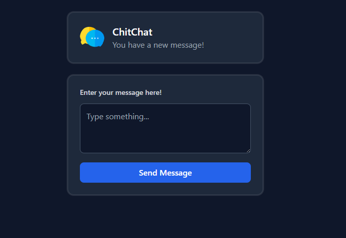

# PHP Form CRUD (with Docker + Render Deployment)

## 📌 Overview
This is a simple **PHP session-based form** styled with Tailwind CSS.  
It allows users to:
- Submit a message
- View the latest and previous messages
- Clear all messages

The app runs entirely on PHP’s built-in server, packaged with Docker for deployment on Render.

---

## 📂 Project Structure
```
.
├── index.php        # Main PHP app (form + session storage)
├── Dockerfile       # Container setup for running PHP on Render
├── render.yaml      # Render deployment configuration
└── README.md        # Project documentation
```
## 🔗 Live Link

Render Link: https://php-form-crud.onrender.com


---

## 🛠 Requirements
- **PHP 8.0+** (for local development)
- **Docker** (for containerized deployment)
- **Git** (to push to GitHub)
- **Render account** (for live hosting)

---

## 🚀 Local Development

### Run with PHP CLI
```bash
php -S localhost:8000
```
Visit: [http://localhost:8000](http://localhost:8000)

### Run with Docker
```bash
docker build -t php-form-crud .
docker run -p 8000:8080 php-form-crud
```
Visit: [http://localhost:8000](http://localhost:8000)

---

## 📦 Dockerfile
This project uses a simple Dockerfile:

```dockerfile
FROM php:8.3-cli

WORKDIR /app
COPY . .

CMD ["sh", "-c", "php -S 0.0.0.0:${PORT:-8080} -t ./"]
```

- Based on the official PHP 8.3 CLI image.
- Copies project files to `/app`.
- Runs PHP’s built-in server on the `$PORT` provided by Render.

---

## 🌐 Deployment to Render

### 1. Push to GitHub
```bash
git init
git add .
git commit -m "Initial commit"
git branch -M main
git remote add origin https://github.com/<your-username>/<repo-name>.git
git push -u origin main
```

### 2. Deploy on Render
1. Go to [Render](https://render.com).
2. Click **+ New → Web Service**.
3. Connect your GitHub repo.
4. Render will detect `render.yaml` and auto-configure the service.
5. Click **Create Web Service** and wait for deployment.

---

## ⚙ `render.yaml` Configuration
```yaml
services:
  - type: web
    name: php-form-crud
    env: docker
    plan: free
    branch: main
    dockerfilePath: Dockerfile
    autoDeploy: true
```

### Explanation:
- **type:** Web service
- **env:** Docker environment
- **plan:** Free tier
- **branch:** Deploys from `main`
- **dockerfilePath:** Path to the Dockerfile
- **autoDeploy:** Auto-deploy on each push

---

## 🛡 Security Notes
- Uses `htmlspecialchars()` to prevent XSS.
- Session data is per-user and cleared with “Clear Messages”.

---

## 📄 License
This project is licensed under the MIT License.


<video controls src="20250812-1126-24.7748211.mp4" title="Title"></video>
